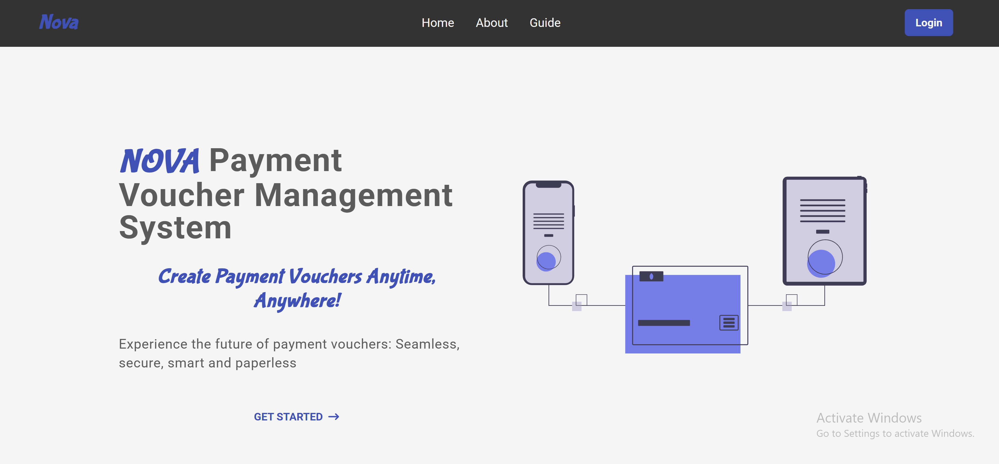
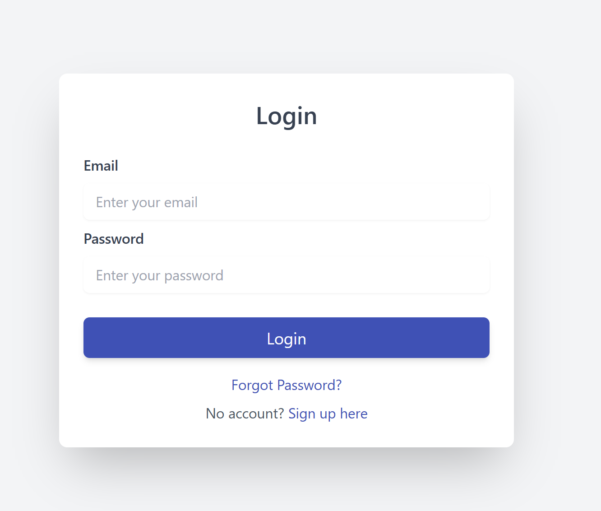
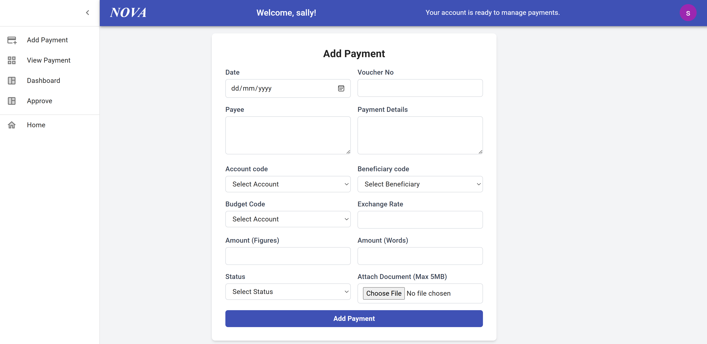
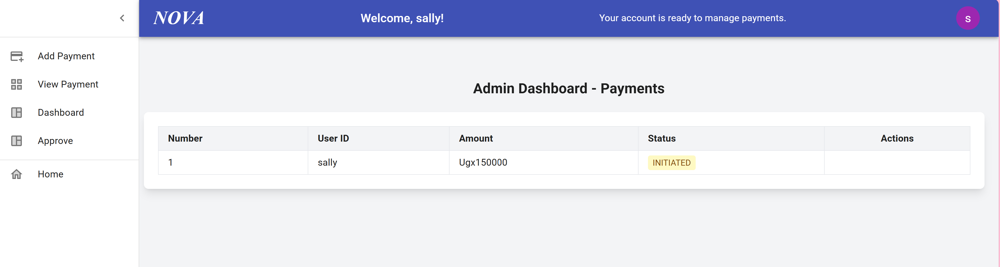
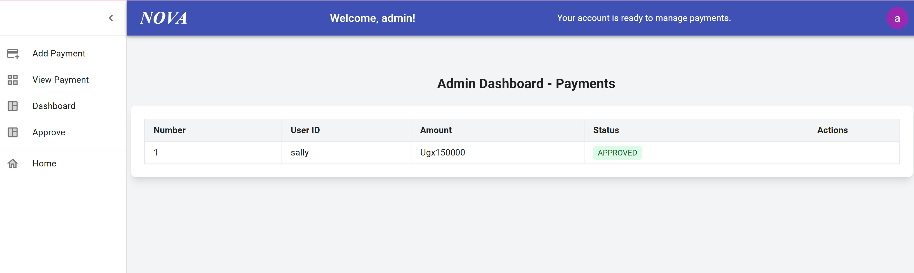
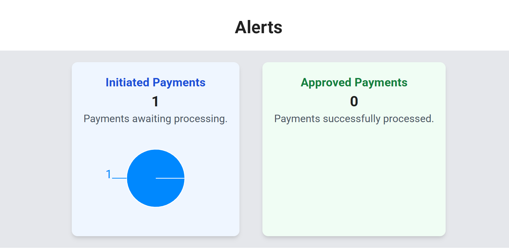

# Nova Payment Manangement System 

## Overview
The **Nova Client** is the user interface for the **Nova Payment Management System**, built to provide a seamless and secure experience for managing organizational payments. Designed for **efficiency, accessibility, and automation**, this frontend eliminates paperwork and allows businesses to initiate and approve payments entirely online.

## Features
✅ **Modern UI/UX** – Intuitive dashboard with real-time transaction tracking.
✅ **Secure Authentication** – Supports OAuth login and role-based access.
✅ **Remote Payment Approval** – Review and approve payments from anywhere.
✅ **Multi-Role Access** – Users can be Initiators or Admins to approve.
✅ **API Integration** – Connects seamlessly with the Nova Pay backend.

## Tech Stack
- **React.js** – Component-based UI development.
- **Tailwind CSS** – Responsive and modern styling.
- **Axios** – Handling API requests efficiently.
- **React Router** – Smooth navigation across the platform.
- **Vite** – Fast and optimized development environment.

## Installation & Setup
### 1. Clone the Repository
```sh
git clone https://github.com/yourusername/nova-pay-frontend.git
cd nova-pay-frontend
```

### 2. Install Dependencies
```sh
npm install
```

### 3. Configure Environment Variables
Create a `.env` file and add the backend API URL:


### 4. Start the Development Server
```sh
npm run dev
```

## Deployment
To build for production, run:
```sh
npm run build
```
Then deploy the `dist` folder to your hosting provider (e.g., **Vercel, Netlify, AWS S3**).

## Screenshots
Here are some UI previews:
- **Landing Page**
  
- **Login Page**
  
- **Dashboard**
  
- **Payment Initiated**
  
- **Payment Approved**
  
- **Payment Status**
  

## Contributing
1. Fork the repository.
2. Create a new branch (`feature-branch`).
3. Make your changes and commit.
4. Push to your fork and create a PR.

## License
This project is licensed under the **MIT License**.

---
🚀 **Nova Pay Frontend – Streamlining digital payments with a modern and secure UI.**
